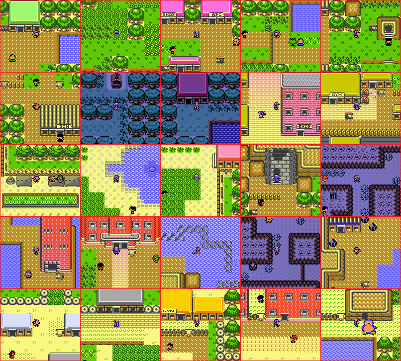

# Pokémon Crystal - Zelda Edition

A tileset overhaul project based on [the Pokémon Crystal disassembly](https://github.com/pret/pokecrystal). The aim is to give every area the look of a GBC Zelda game, namely styled after Link's Awakening, with cues taken from the Oracle games.

## Changes
While the story and progression are unchanged, here's some new things you can expect when playing this hack:
* Overhauled overworld and interior graphics, alongside some UI elements.
* Tweaked trainer teams, namely harder rosters for important trainers, such as Gym Leaders.
* An expanded Kanto, with restored dungeons, more trainers, and more items.
* More sensible Pokémon distribution (as seen [here](NEW_LOCATIONS.txt)), and more generous HM compatibility.
* Fixed off-model Pokémon sprites. Palettes were also improved for a good amount of Pokémon.
* Some QOL features, like "Running Shoes" (works by holding down B), and an automatic Repel reuse message.
* Fixed [bugs and glitches](https://github.com/pret/pokecrystal/blob/master/docs/bugs_and_glitches.md).
* The Celebi event, now restored! To get it, simply head to Goldenrod's Pokémon Center after beating the League.

(Do note that this rom hack is not compatible with base GSC.)*

## Version
The current version is **1.2.3**, with changes documented in [the changelog](CHANGELOG.txt). Please note that while it can be played from start to end, this hack is not 100% done yet. Some small hiccups are still left to be taken care of, with a list of known issues listed [here](KNOWN_ISSUES.txt).

If you encounter any issues *not* listed in "Known Issues" while playing, feel free to open an **Issue** or a **Pull Request**, and I'll definitely give it a look. Hope you guys will have fun playing Crystal through a different lens!

To compile this rom hack, pokezelda requires RGBDS v0.5.2.

## Credits
Some HUGE thanks to:
* All the amazing people who worked tirelessly on the different Pokémon disassemblies.
* The awesome folks who wrote down the various tutorials for Pokecrystal.
* The Polished Crystal team, for some script changes and new trainer sprites.
* Artists [LuigiTKO](https://twitter.com/LuigiTKO) and [GuiAbel](https://twitter.com/guiabel/) for their gorgeous GSC-styled Pokémon icons.
* The artists from Pokémon Showdown and Pokémon Crystal Clear for a few Pokémon icons.
* SoupPotato, creator of [Sourcrystal](https://github.com/SoupPotato/Sourcrystal), for some incredible new Pokémon sprites.
* Artist [Dewndeym](https://twitter.com/dewndeym) from the Johto Redrawn project, for their amazing revamped Ilex Shrine.
* My friends Idain and Seasick, for graphical help, as well as general troubleshooting. I truly wouldn't have been able to finish this hack without them.
* The original devs and artists over at Nintendo/Capcom who worked on Link's Awakening and the Oracle games.

## Screenshots

