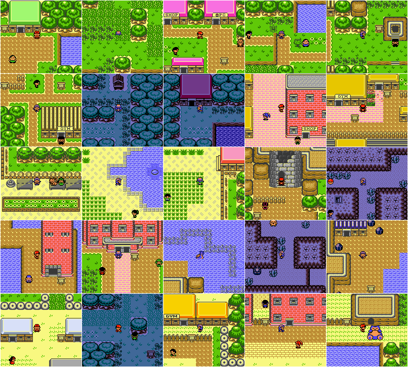

# Pokémon Crystal - Zelda Reskin

A tileset overhaul project based on [the Pokémon Crystal disassembly](https://github.com/pret/pokecrystal). The aim is to give every map the look of a GBC Zelda game, namely styled after Link's Awakening, with cues taken from the Oracle games.

## Changes
This version of the game is mostly identical to base pokecrystal, with a few exceptions:
* Overhauled overworld and interior graphics.
* Expanded Kanto, with restored dungeons, more trainers and more items.
* Tweaked trainer teams, and harder teams for important trainers, such as Gym Leaders.
* Fixed off-model Pokémon sprites, and some new sprites/palettes for a handful of Pokémon.
* Fixed [bugs and glitches](https://github.com/pret/pokecrystal/blob/master/docs/bugs_and_glitches.md), aside from multiplayer-related issues, as to ensure compatibility with base GSC.
* Made the HM repartition more generous.
* Restored Celebi event. Simply head to Goldenrod's Pokémon Center after beating the League.
* Implemented "Running Shoes" (run by holding down B).
* Implemented Daily Lucky Number generation (instead of weekly).
* Implemented Repel reuse message.
* Implemented item chance when smashing rocks.

## Version
The current version is **1.0.0**, with changes documented in [the changelog](CHANGELOG.txt). If you encounter any issues while playing, feel free to open an **Issue** or a **Pull Request**, and I'll definitely give it a look. Hope you guys will have fun playing Crystal through a different lens!

## Credits
Some HUGE thanks to:
* All the amazing people who worked tirelessly on the different Pokémon disassemblies.
* All the awesome folks who wrote down the various tutorials on Pokecrystal.
* The Polished Crystal team, for some script changes and new trainer sprites.
* Artist [LuigiTKO](https://twitter.com/LuigiTKO) for his gorgeous GSC-styled Pokémon icons.
* My friends Idain and Seasick, for graphical help, as well as general troubleshooting.
* The original devs and artists who worked on Link's Awakening and the Oracle games.

## Screenshots

